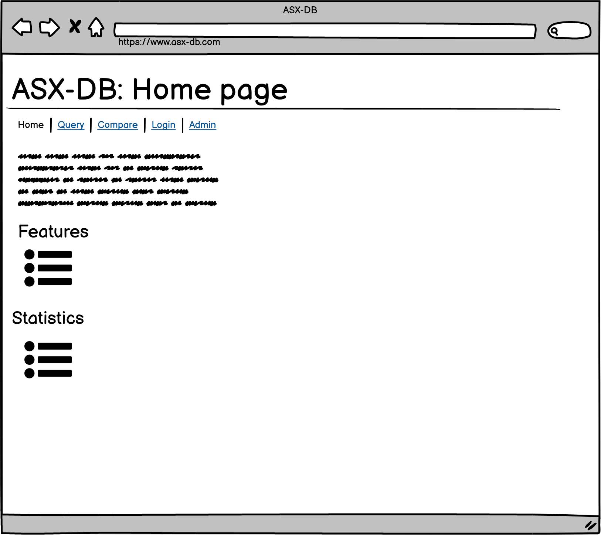

# User Stories:

As an Investor, I want to be able to find financial information about companies I am interested in so that I can make an informed decision based on the their fundamental finance about whether to invest in them.

As an Investor, I want to be able to query the ASX database for companies that match my search criteria and to be able to visualize the results in a graph. 

As a Database Administrator, I want to be able to add new companies to the database so that I can keep track of all the companies I am interested in.

As a Database Administrator, I was my data to be backed up so that I can restore my data if anything goes wrong.

As a Developer, I want to be able to add new features to the application so that I can add new functionality to the application.

As a Developer, I want the data in my database to be kept up to date automatically.

As a User, I want to be able to create an account so that I can track and monitor companies that I am interested in.

As an Administrator of the application, I want to be able to create, edit and delete records in the database.

As a Developer, I want to restrict some access and features of the site so that I can make sure that only the right people can access the site.

# Wireframes:

## Homepage

- User Story:

As a user of the application, I want to be able to view the homepage so that I can understand the purpose of the application and how to use it.

- Description:

The homepage serves as the landing page for the application. It is the first page that the user sees when they open the application and explains the purpose of the application as well as describing features and statistics about the use of the application.

- Acceptance Criteria:

1. Display page title.
2. Navigation bar.
3. Features list.
4. Application statistics.

## Query

- User Story:

As a user of the application, I want to be able to query for ticker information so that I can view financial information about listed companies that I am interested in.

- Description:

The query page allows users to search for tickers, filter and view the information of companies that they are interested.

- Acceptance Criteria:

1. Create a table with the following columns: Ticker, Company Name, Category, Market Capitalization.
2. Allow users to filter by category and by greater than or less then a specified market capitalization.
3. Allow users to search for a specific ticker or company name.
4. Allow users to select certain companies to compare in further detail.

Agile Update:

Functionality to 'follow' companies by adding them to a users portfolio has been removed. This feature would add unnecessary complexity to the application that has already demonstrated in T3A2.

## Compare

User Story:

As a user of the application I want to be able to compare the financial information of different companies that I am interested in so that I can interpret their value.

Description:

The query page allows for users to compare the financial information of different companies that have been selected and to visualise the comparison in a graph.

Acceptance Criteria:

1. Create a graph that shows a comparison of companies that have been selected.
2. Allows users to search and add companies to the graph.
3. Display a legend to show which companies are being compared.
4. Add functionality to add or remove companies from the comparison.
5. Multiple graphs may be required to compare different aspects of the selected companies (e.g. cash flow, balance sheet, etc.)

Agile Update:

Functionality to add or remove companies from the comparison has been added. Also multiple graphs may be required to compare the different aspects of the selected companies.

## Login

User Story:

As a user of the application I want to be able to be able to login to the application so that I can add companies that I am interested in to my portfolio and to access their financial information quickly and easily in the future. 

Description:

The login page allows users to login and register a personal account with the application. This page will handle authentication of the user session.  

Acceptance Criteria:

1. Accept user input for username and password.
2. Allow users to choose to either register a new account or to login to an existing account.
3. Validate the user input and authenticate the user.
4. Display an error message if the user input is invalid.

Agile Update:

Functionality to login to the application has been removed. This feature would only allow users to add companies to their portfolio and would add unnessary complexity to the application that has already been demonstrated in T3A2.

## Profile

- User Story:

As a user of the application I want to be able to be able to login to the application so that I can add companies that I am interested in to my portfolio and to access their financial information quickly and easily in the future. 

- Description:

The user profile page will display personal information about the user and allow them to edit their information. This page will also display companies that the user is interested in and allow them to add or remove companies from their portfolio. 

- Acceptance Criteria: 

1. Allow users to view their personal information.
2. Allow users to upload or edit a profile picture.
3. Allow users to view and remove companies from their portfolio.

## Admin Dashboard

- User Story:

As an admin to the application I want to be able to created, update and delete records in the database so that I can control the data that is displayed on the application.

- Description: 

The admin page allows the admin to add, update and delete companies that are included in the database.

- Acceptance Criteria:

1. Allow admin to enter API key to authorize elevated administration permissions.
2. Check that the API key is valid.
3. Allow admin to add, update and delete companies data that is stored in the database.

- Agile Update:
Front end admin dashboard functionality has been removed. Instead the admin will interface with the website using an API key and API platform such as postman to preform admin actions. 

