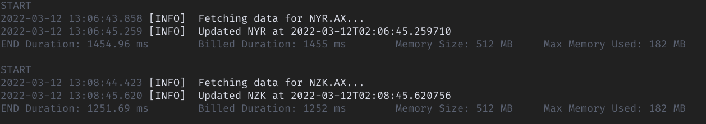

<!--
title: 'Serverless Framework Python Flask API backed by DynamoDB on AWS'
description: 'This is a Python Flask API service backed by DynamoDB running on AWS Lambda using Serverless framework \

-->

# ASX DB - A Python Flask Web application running on AWS Lambda and backed by DynamoDB.

Deployed at https://www.asx-db.com/

This is a cloud native web application that stores financial information (Information, Cash flow, Balance sheet and Income statement) for companies that are listed on the Australian Stock Exchange. It it has been designed to be scalable and reliable whilst incurring minimal hosting fees.

This application demonstrates full stack cloud native development and has been built using:

- Serverless Framework
- AWS Lambda
- AWS DynamoDB (NoSQL)
- Flask - Python Web Framework
- Jinja2 - Python Templating Library
- Pandas - Python Data Analysis Library

## Features 

- Cloud native, serverless application that is scalable, reliable, easy to deploy and cheap
- Uses AWS Lambda, DynamoDB, and Flask to provide a REST-Like API
- An API Key is used to authorise a function to initialise database for all 2,000+ tickers listed on the ASX.
- Information, Cash Flow, Balance Sheet and Income Statement is stored for each ticker.
- Lambda functions are automatically kept warm to prevent cold starts. 
- Fresh data is automatically scraped via cron job every 2 minutes to update tye oldest data in the database.
- 6 Global Secondary Indexes enables the database to be sorted by Ticker, Name, Market Cap, Date Listed, GICs Group and Date Updated.
- Threading is used to speed up (4x) the execution time of scraping Info, Cash flow, Balance sheet and Income statement
- Custom pagination is implemented to allow for pagination (forward and reverse of the data) 

## Anatomy 

This application includes three functions, the `api` function (./flaskApp/app.py) is responsible handling all incoming requests by configured http events. The `Flask` framework is responsible for routing and handling requests internally. The implementation takes advantage of `serverless-wsgi`, which allows you to wrap WSGI applications such as Flask apps. 

The application also provisions a NoSQL DynamoDB database that stores financial data for all companies that are listed on the Australian Stock Exchange. The database is configured to autoscale according to load and has 6 additional Global Secondary Indexes to allow sorting of the data.

The `autoUpdate` function (./dev/dev.py) is configured to execute automatically every two minutes. First it retrieves the oldest data from the database, then requests new information, cash flow, income statement and balance sheet information from Yahoo and updates the new data in the database. These requests are made concurrently - to minimise execution time.

The `init` function (./dev/dev.py) initialises the database with basic information (ticker, company name, market cap and listing date). As a security measure it can only be called via a POST request that has been authorised via AWS IAM. 

## Error Testing:

For local testing, UnitTesting is provided in the file `./flaskApp/test_app.py`, To execute correctly it will require both `serverless wsgi serve` and `serverless dynamodb start` services to be running.

Further manual testing can be done via executing a post request to either `http://localhost:5000/init` or `http://localhost:5000/update/<ticker>`

Further monitoring can be observed via AWS CloudWatch. Logs can be viewed with the commands:
` serverless logs -f api -t`
` serverless logs -f autoUpdate -t`
` serverless logs -f init -t`



Example log of autoUpdate function indicating that the function has been executed successfully and the execution time.


## Installation

### Prerequisites

In order to package your dependencies locally with `serverless-python-requirements`, you need to have `Python3.8` installed locally. You can create and activate a dedicated virtual environment with the following command:

```bash
python3.8 -m venv ./venv
source ./venv/bin/activate
```

### Deployment

This example is made to work with the Serverless Framework dashboard, which includes advanced features such as CI/CD, monitoring, metrics, etc.

In order to deploy with dashboard, you need to first login with:

```
serverless login
```

install dependencies with:

```
npm install
```

and then perform deployment with:

```
serverless deploy 
```

### Local development

It is also possible to run your application locally, however, in order to do that, you will need to first install `werkzeug`, `boto3` dependencies, as well as all other dependencies listed in `requirements.txt`. It is recommended to use a dedicated virtual environment for that purpose. You can install all needed dependencies with the following commands:

```bash
pip install werkzeug boto3
pip install -r requirements.txt
```

Additionally, you will need to emulate DynamoDB locally, which can be done by using `serverless-dynamodb-local` plugin. In order to do that, execute the following commands:

```bash
serverless plugin install -n serverless-dynamodb-local
serverless dynamodb install
```

```

Now you can start DynamoDB local with the following command:

```bash
serverless dynamodb start
```

At this point, you can run your application locally with the following command:

```bash
serverless wsgi serve
```