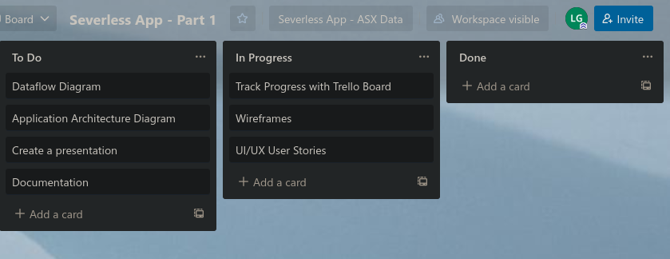
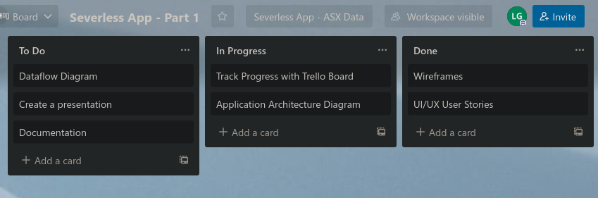
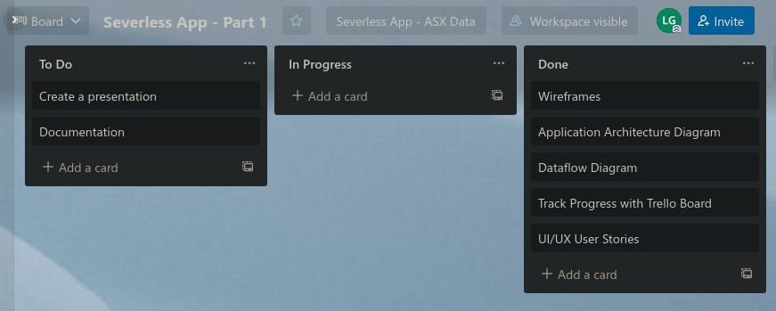
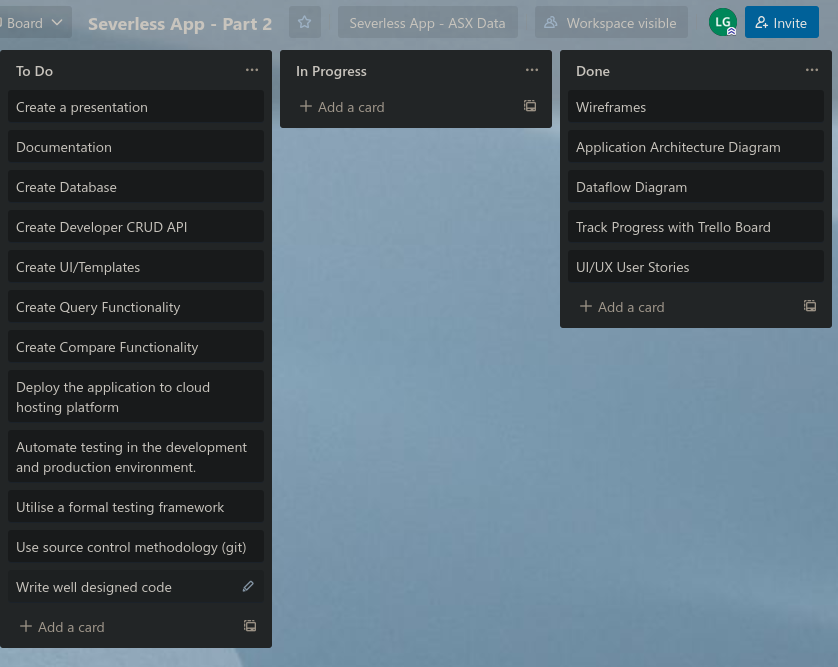

# Trello Board

## Part A

### Update 1:

Start with a blank board. 

### Update 2:

Add assignment requirements to the board: 

- Dataflow Diagram
- Application Architecture Diagram
- Create a presentation
- Documentation
- Track Progress with Trello Board
- Wirefreames 
- UI/UX User Stories

Start with writing user stories to define the requirements of the application. At the same time start drawing wireframes that incorporate the user stories - Make modifications as required. 

### Update 3:

User stories and wireframes have been completed.
Started to write the application architecture diagram to describe the technology stack that will be used to build the application.

### Update 4:

The architecture diagram has been completed. Start to write the dataflow diagram to map how data utilised by the application will be used. 

### Update 5:

The requirements for Part - A of the assignment have been completed. Remaining components:

- Create a presentation
- Documentation

Will be completed as a part of Part B.

## Part B

### Update 1:

Added project requirements associated with Part B:

- Create Database
- Create developer CRUD API
- Create UI/Templates Create Query Functionality
- Deploy the application to a cloud hosting platform
Automate testing in the development and production environment
- Utilise a formal testing framework
- Use source control methodology (git)
- Write well designed code.

